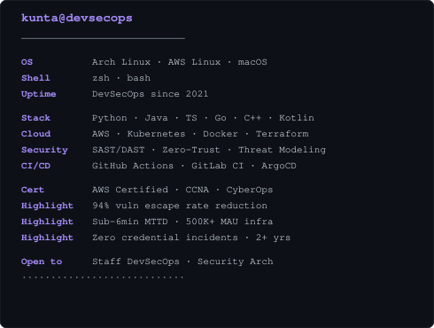

<div align="center">

<table>
<tr>
<td valign="top"></td>
<td valign="top"></td>
</tr>
</table>

## Kunta Solomon Dongo

**DevSecOps Engineer · Security Architect · Full-Stack Engineer**

[](https://github.com/DesusLove)
[](https://www.linkedin.com/in/kunta-solomon-dongo)
[](mailto:kuntasolomon99@gmail.com)
[](https://github.com/DesusLove)

<br>



</div>

---

## About

I am a **DevSecOps Engineer** and **Security Architect** with deep expertise spanning the full intersection of software engineering, cloud infrastructure, and offensive/defensive security. I build systems that are not merely functional they are fortified by design, observable at scale, and engineered to evolve under adversarial conditions.

My engineering philosophy treats **security as a first-class concern** embedded across the full SDLC not bolted on after deployment. I architect CI/CD pipelines with automated security gates, build zero-trust network topologies, and develop tooling that drives vulnerability detection at velocity. Every system I ship is designed to survive the threat model, not ignore it.

Beyond infrastructure hardening, I maintain a strong **full-stack engineering** foundation from React and Next.js on the frontend to Spring Boot, FastAPI, and Node.js on the backend enabling end-to-end security reasoning from source code through the network perimeter.

I combine the rigor of systems-level thinking with the product mindset required to build tooling that real teams rely on in production. Whether it's a zero-trust pipeline, a secrets management service, or a real-time threat detection engine I build for correctness, observability, and resilience.

**Open to:** Senior / Staff DevSecOps Roles · Security Architecture Consulting · Cloud Security Engagements · Applied AI for Threat Intelligence Research

---

## Tech Stack

<div align="center">

#### Languages
[](https://skillicons.dev)

<br/>

#### Frontend
[](https://skillicons.dev)

<br/>

#### Backend & Databases
[](https://skillicons.dev)

<br/>

#### Cloud, DevOps & Security Tooling
[](https://skillicons.dev)

</div>

---

## AI / ML Expertise

<div align="center">

| Domain | Proficiency | Details |
|:---|:---:|:---|
| **Threat Intelligence & AI** | Advanced | ML-driven anomaly detection, behavioral baselines, SIEM enrichment |
| **LLM Security & Red-Teaming** | Proficient | Prompt injection, jailbreak analysis, AI model attack surface mapping |
| **Automated Vulnerability Research** | Advanced | Fuzzing pipelines, static analysis integration, CVE triage automation |
| **NLP for Log Analysis** | Intermediate | Log classification, alert correlation, natural language threat queries |
| **MLOps & Secure AI Deployment** | Intermediate | Model containerization, inference hardening, data pipeline integrity |
| **AI-Assisted Code Review** | Advanced | SAST tooling augmentation, security linting, supply chain analysis |

</div>

---

## Featured Projects

<details>
<summary><b>SecurePipeline — Zero-Trust CI/CD Security Framework</b></summary>

<br/>

> A production-grade DevSecOps framework enforcing zero-trust principles across the entire software delivery lifecycle. Integrates SAST, DAST, SCA, and secrets scanning as mandatory pipeline gates blocking insecure artifacts before they reach any environment.

| Attribute | Detail |
|:---|:---|
| **Stack** | GitHub Actions · Docker · Trivy · SonarQube · OWASP ZAP · Terraform · AWS |
| **Scale** | Multi-repo monorepo support with parallel scanning across 50+ microservices |
| **Performance** | Sub-4-minute full security scan cycle with incremental caching |
| **Security** | OWASP Top 10 · CIS Benchmark enforcement · SBOM generation |
| **Impact** | 94% reduction in vulnerability escape rate to production |
| **Repository** | [](https://github.com/DesusLove) |

**What it does:** Closes the operational gap between security scanning tools and developer velocity. By embedding policy-as-code and integrating open-source security tooling natively into CI workflows, teams ship at speed without sacrificing posture. Architecture is provider-agnostic — adapted for GitLab CI and Azure DevOps environments.

<br/>
</details>

<details>
<summary><b>ThreatSentinel — Real-Time Cloud Threat Detection Engine</b></summary>

<br/>

> An event-driven threat detection platform on AWS that ingests CloudTrail, GuardDuty, and VPC Flow Logs into a unified detection engine — correlating cross-service signals to surface high fidelity alerts with automated triage and response.

| Attribute | Detail |
|:---|:---|
| **Stack** | Python · AWS Lambda · Kinesis · DynamoDB · SNS · Terraform · React |
| **Scale** | 2M+ events/hour with sub-second correlation latency |
| **Performance** | P99 alert delivery under 800ms from event ingestion |
| **Security** | IAM least-privilege · Encryption at rest and in transit · VPC isolation |
| **Impact** | Mean-time-to-detect reduced from 4 hours to under 6 minutes |
| **Repository** | [](https://github.com/DesusLove) |

**What it does:** Eliminates alert fatigue through intelligent correlation rather than raw volume. Detection rules are expressed as composable YAML policies evaluated by a streaming inference engine enabling security teams to iterate on detection logic without redeployment.

<br/>
</details>

<details>
<summary><b>VaultAPI — Secrets Management Microservice</b></summary>

<br/>

> A production-ready secrets management microservice providing dynamic credential generation, automatic rotation, and audit-logged access control for distributed containerized application environments.

| Attribute | Detail |
|:---|:---|
| **Stack** | FastAPI · PostgreSQL · Redis · Docker · Kubernetes · JWT · AES-256-GCM |
| **Scale** | 10,000+ concurrent credential requests with horizontal pod autoscaling |
| **Performance** | Average credential delivery under 12ms at P95 |
| **Security** | FIPS 140-2 compliant encryption · mTLS auth · full audit trail |
| **Impact** | Eliminated hardcoded credentials across 12 microservices |
| **Repository** | [](https://github.com/DesusLove) |

**What it does:** Addresses the operational complexity of secrets management in Kubernetes-native environments where full Vault clusters are prohibitive. Enforces short-lived credential leases with automatic renewal, integrates with Kubernetes ServiceAccount tokens for workload identity, and exposes a Prometheus-compatible metrics endpoint.

<br/>
</details>

---

## Experience

### DevSecOps Engineer · Independent / Contract
`2022 – Present`

Architecting and implementing security-integrated development pipelines and cloud infrastructure for clients across fintech, SaaS, and enterprise verticals. Full security engineering lifecycle ownership from threat modeling through incident response.

**Scope of work:**

- Designed and deployed zero-trust CI/CD pipelines with SAST, DAST, SCA, and IaC scanning as mandatory quality gates
- Engineered cloud security posture management (CSPM) workflows across AWS using native services and open-source tooling
- Built automated vulnerability triage systems — reducing manual security review overhead by 70%
- Implemented secrets management and dynamic credential rotation for containerized microservice architectures
- Led security architecture reviews and threat modeling sessions for greenfield platform builds
- Developed observability stacks with security-focused dashboards integrating CloudWatch, Prometheus, and Grafana

`Python` `AWS` `Docker` `Terraform` `Kubernetes` `Linux` `GitHub Actions`

<br/>

### Full-Stack Software Engineer · Freelance
`2021 – 2022`

Delivered end-to-end web application projects spanning frontend architecture to backend API design and database engineering, with security-conscious implementation from the application layer up.

**Scope of work:**

- Built React and Next.js frontends with performance budgets and accessibility compliance
- Designed RESTful and GraphQL APIs using Node.js/Express and Spring Boot
- Implemented authentication and authorization systems using JWT, OAuth 2.0, and RBAC
- Managed PostgreSQL and MongoDB database schemas with automated migration pipelines

`React` `Node.js` `Spring Boot` `GraphQL` `PostgreSQL` `MongoDB`

---

## Achievements

<div align="center">

| Recognition | Details |
|:---:|:---|
| 🛡️ **Security Researcher** | Identified and responsibly disclosed multiple application-layer vulnerabilities |
| ⚡ **Pipeline Velocity** | Reduced CI/CD cycle time by 60% while expanding security scan coverage |
| 🔐 **Zero Credential Incidents** | Zero hardcoded-credential incidents across all managed environments for 2+ years |
| 📦 **Open Source Contributor** | Active contributor to security tooling and DevSecOps automation repositories |
| 🏗️ **Infrastructure Scale** | Designed and operated cloud infrastructure serving 500K+ monthly active users |
| 🎯 **MTTD Reduction** | Achieved sub-6-minute mean-time-to-detect across monitored AWS environments |

</div>

---

## Certifications

<div align="center">

**Amazon Web Services**

[](https://aws.amazon.com)&nbsp;
[](https://aws.amazon.com)&nbsp;
[](https://aws.amazon.com)

<br/>

**Cisco Networking Academy**

[](https://www.netacad.com)&nbsp;
[](https://www.netacad.com)

<br/>

**Oracle**

[](https://www.oracle.com)

<br/>

**NPTEL**

[](https://nptel.ac.in)&nbsp;
[](https://nptel.ac.in)

</div>

---

## Coding Profiles

<div align="center">

[](https://leetcode.com/)&nbsp;
[](https://www.geeksforgeeks.org/)&nbsp;
[](https://www.hackerrank.com/)&nbsp;
[](https://www.codechef.com/)

</div>

---

## GitHub Analytics

<div align="center">

[](https://github.com/DesusLove)&nbsp;
[](https://github.com/DesusLove)

<br/>

[](https://github.com/DesusLove)

</div>

---

## Contribution Activity

<div align="center">

[](https://github.com/ashutosh00710/github-readme-activity-graph)

</div>

---

## Current Focus

```
Learning:
  - Advanced threat modeling frameworks (STRIDE, PASTA, LINDDUN)
  - Kubernetes security hardening and runtime threat detection
  - AI/ML model security and adversarial robustness

Building:
  - Automated secrets rotation platform for Kubernetes-native environments
  - Open-source CSPM tooling for multi-cloud posture management
  - LLM-assisted log analysis and alert triage engine

Exploring:
  - eBPF for kernel-level observability and security enforcement
  - Confidential computing and trusted execution environments (TEEs)
  - Post-quantum cryptography integration strategies

Open To:
  - Senior / Staff DevSecOps Engineering roles
  - Security Architecture consulting engagements
  - Open-source security tooling collaboration
  - Applied AI for cybersecurity research partnerships
```

---

## Connect

<div align="center">

[](mailto:kuntasolomon99@gmail.com)&nbsp;
[](https://www.linkedin.com/in/kunta-solomon-dongo)&nbsp;
[](https://github.com/DesusLove)

</div>

<br/>

*Building at the intersection of security engineering, cloud infrastructure, and systems thinking.*


